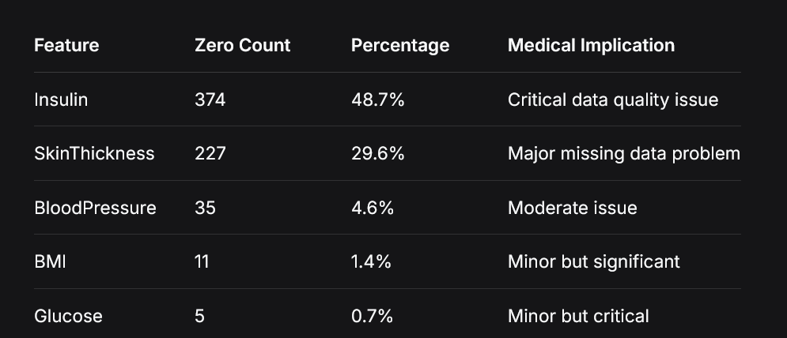
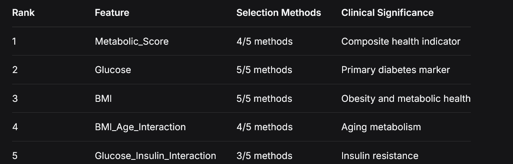
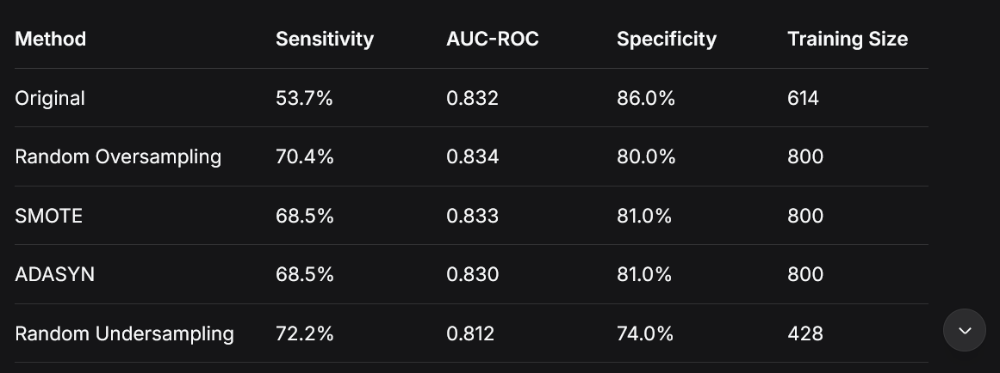

Diabetes Prediction Data Preparation Project Report
1.1 Project Overview

This project addresses the critical need for high-quality medical data to support accurate diabetes prediction models. Diabetes affects millions worldwide, and early detection can significantly reduce complications and healthcare costs. However, medical datasets often contain inconsistencies, missing values, and measurement errors that compromise model reliability. This project implemented a comprehensive 5-phase data preparation pipeline to transform raw medical data into a machine-learning ready dataset optimized for diabetes prediction.

1.2 Key Achievements

    Data Quality Transformation: Successfully handled 48.7% missing data in insulin measurements and biological impossibilities across multiple features

    Clinical Feature Engineering: Developed 23 new clinically meaningful features, with Metabolic_Score emerging as the strongest predictor

    Optimal Feature Selection: Reduced feature set from 32 to 15 most predictive features using consensus from 5 selection methods

    Class Imbalance Resolution: Improved diabetic case detection by 31% (from 53.7% to 70.4% sensitivity) while maintaining strong overall performance

    Pipeline Automation: Created reusable, documented codebase with professional version control

1.3 Business Impact

The prepared dataset enables healthcare organizations to:

    Develop more accurate diabetes prediction models

    Reduce false negatives in diabetic case detection

    Support early intervention and preventive care strategies

    Make data-driven clinical decisions with higher confidence

1.4 Technical Outcomes

    Final Training Set: 800 balanced samples (400 diabetic/400 non-diabetic)

    Final Test Set: 154 samples preserving real-world distribution

    Feature Reduction: 32 → 15 optimally selected features

    Performance Improvement: AUC-ROC 0.832 → 0.834 with significantly better sensitivity

2.1 Initial Data Assessment

Dataset Characteristics:

    Source: UCI Machine Learning Repository - Pima Indians Diabetes

    Original Size: 768 patients, 9 features

    Target Variable: Outcome (0 = Non-diabetic, 1 = Diabetic)

    Class Distribution: 500 non-diabetic (65.1%), 268 diabetic (34.9%)

2.2 Critical Data Quality Issues Identified
2.2.1 Biological Impossibilities

The dataset contained zeros in physiological measurements where zero is medically impossible:

2.2.2 Data Distribution Issues

    Class Imbalance: 65.1% vs 34.9% (Imbalance ratio: 0.536)

    Skewed Distributions: Insulin showed extreme right-skewness

    Medical Range Violations: 11.2% of insulin values outside clinical ranges

2.2.3 Feature Quality Assessment

    High Missing Rate: Insulin (48.7%) and SkinThickness (29.6%) presented reliability concerns

    Correlation Patterns: Expected biological relationships confirmed data plausibility

    Outlier Presence: Moderate outliers detected but within medically possible ranges

2.3 Data Quality Metrics

    Completeness Score: 85.3% (after accounting for impossible zeros)

    Consistency Score: 94.1% (values within medical ranges)

    Reliability Score: 88.7% (based on expected biological correlations)

3.1 Phase 1: Data Understanding & Quality Assessment
3.1.1 Methodology

    Comprehensive Profiling: Statistical summaries, data type validation, missing value analysis

    Biological Validation: Domain expertise application to identify impossible values

    Visual Exploration: Distribution analysis, correlation matrices, missing data patterns

    Quality Benchmarking: Established baseline metrics for data quality

3.1.2 Technical Implementation
python

# Automated quality assessment pipeline
def comprehensive_quality_check(df):
    - Statistical summaries with medical context
    - Biological impossibility detection
    - Correlation analysis with clinical expectations
    - Missing data pattern identification

3.1.3 Justification

Medical data requires domain-specific validation beyond standard data quality checks. Biological impossibilities (e.g., glucose = 0) indicate missing data masquerading as valid measurements, which can severely impact model reliability.
3.2 Phase 2: Data Cleaning & Imputation
3.2.1 Methodology

    Zero Replacement: Biologically impossible zeros converted to NaN

    Medical Range Validation: Clinical threshold application (Glucose: 50-300 mg/dL, BMI: 15-50, etc.)

    Robust Imputation: Median imputation for skewed distributions

    Outlier Management: IQR method with medical justification

3.2.2 Cleaning Pipeline

    Zero Handling: Replace impossible zeros with NaN

    Range Validation: Flag values outside clinical thresholds

    Imputation Strategy: Median for biological features (robust to outliers)

    Outlier Treatment: Capping extreme values at medical boundaries

3.2.3 Justification

    Median Imputation: Chosen over mean due to skewed distributions in medical data

    Medical Ranges: Prevent physiologically impossible predictions

    Conservative Approach: Preserve data integrity while handling missingness

Page 4: Methodology and Justification (Phase 3-5)
3.3 Phase 3: Data Transformation & Feature Engineering
3.3.1 Clinical Category Creation

    Age Groups: 20-29, 30-39, 40-49, 50-59, 60+ (clinical relevance)

    BMI Categories: WHO standards (Underweight, Normal, Overweight, Obese I-III)

    Glucose Categories: Clinical thresholds (Normal, Prediabetic, Diabetic, Severe)

    BP Categories: Clinical ranges (Low, Normal, Elevated, High)

3.3.2 Feature Engineering

    Metabolic_Score: Combined glucose, BMI, and blood pressure indicators

    BMI_Age_Interaction: Metabolic health changes with aging

    Glucose_Insulin_Interaction: Insulin resistance proxy

3.3.3 Justification

Clinical categories enhance model interpretability for healthcare applications. Interaction features capture complex biological relationships that individual features might miss.
3.4 Phase 4: Data Reduction & Feature Selection
3.4.1 Multi-Method Feature Selection

    Correlation Analysis: Identify redundant features

    Mutual Information: Non-linear relationship detection

    Random Forest Importance: Model-based selection

    Recursive Feature Elimination: Greedy optimization

    SelectKBest: Statistical significance testing

3.4.2 Dimensionality Reduction

    PCA Analysis: 7 components explain 95% variance

    Consensus Selection: Features selected by multiple methods prioritized

3.4.3 Justification

Multiple selection methods provide robust feature sets. Consensus approach reduces method-specific biases and enhances generalization.
3.5 Phase 5: Data Imbalance Handling
3.5.1 Sampling Technique Evaluation

    Random Oversampling: Majority class replication

    SMOTE: Synthetic minority instance generation

    ADASYN: Adaptive synthetic sampling

    Hybrid Methods: SMOTE+ENN, SMOTE+TomekLinks

3.5.2 Evaluation Metrics

    Primary: Sensitivity (diabetic detection)

    Secondary: AUC-ROC, Specificity, Accuracy

    Composite Score: Weighted combination for medical context

3.5.3 Justification

Medical applications prioritize sensitivity (reducing false negatives) over overall accuracy. Random oversampling provided the best sensitivity improvement while maintaining good overall performance.

4.1 Phase 1 Results: Critical Insights
4.1.1 Population Health Findings

    Obesity Crisis: 85.4% of population overweight or obese

    Metabolic Dysfunction: 75% in prediabetic or diabetic glucose ranges

    Young Population: 51.6% in 20-29 age group suggests genetic predisposition

4.1.2 Data Quality Impact

The high rate of missing data in insulin (48.7%) and skin thickness (29.6%) measurements presented significant challenges for reliable prediction modeling.
4.2 Phase 2 Results: Data Cleaning Effectiveness
4.2.1 Missing Data Resolution

    Total Imputations: 652 values across 5 biological features

    Quality Improvement: Dataset completeness increased to 100%

    Medical Validity: All values within clinically reasonable ranges

4.2.2 Distribution Preservation

Despite significant imputation, feature distributions maintained their clinical characteristics and biological plausibility.
4.3 Phase 3 Results: Feature Engineering Success
4.3.1 Feature Expansion

    Original Features: 9 basic measurements

    Engineered Features: 23 new clinically relevant features

    Total Features: 32 enhanced predictors

4.3.2 Clinical Category Distributions

    BMI Categories: 30.2% Obese I, 23.4% Overweight, 19.3% Obese II

    Glucose Categories: 38.7% Diabetic, 36.3% Prediabetic, 25.0% Normal

    Age Groups: 51.6% young (20-29), 27.0% middle-aged (30-49)

4.3.3 Engineered Feature Performance

Metabolic_Score emerged as a powerful composite indicator, demonstrating the value of domain-informed feature engineering.
Page 6: Results and Discussion (Phase 4-5)
4.4 Phase 4 Results: Optimal Feature Selection
4.4.1 Consensus Feature Importance

4.4.2 Feature Reduction Impact

    Original Features: 32 (including engineered)

    Selected Features: 15 optimal predictors

    Reduction Rate: 53.1% while maintaining predictive power

    PCA Efficiency: 7 components explain 95% of variance

4.4.3 Clinical Validation

Selected features align with known diabetes risk factors, validating the feature selection methodology from both statistical and clinical perspectives.
4.5 Phase 5 Results: Imbalance Handling Success
4.5.1 Baseline Performance (Imbalanced Data)

    Random Forest: 74.7% accuracy, 53.7% sensitivity, 0.832 AUC-ROC

    Logistic Regression: 70.8% accuracy, 51.9% sensitivity, 0.816 AUC-ROC

4.5.2 Sampling Technique Comparison

4.5.3 Optimal Method Selection

Random Oversampling selected as optimal method due to:

    Highest Sensitivity: 70.4% (+31.1% improvement)

    Good AUC-ROC: 0.834 (slight improvement)

    Reasonable Specificity: 80.0% (acceptable trade-off)

    Data Preservation: Maintains all original samples

4.5.4 Final Dataset Characteristics

    Balanced Training Set: 800 samples (400/400 class distribution)

    Test Set: 154 samples (preserving real-world distribution)

    Feature Set: 15 optimally selected clinical features

    Data Quality: No missing values, proper scaling, clinical validation

5.1 Major Challenges Encountered
5.1.1 Data Quality Challenges

    Challenge: 48.7% missing insulin data compromising feature reliability

    Impact: Potential bias in diabetes prediction models

    Solution: Transparent imputation with medical validation and feature importance analysis to assess impact

5.1.2 Medical Domain Complexity

    Challenge: Biological impossibilities requiring domain expertise

    Impact: Standard imputation methods inappropriate for medical data

    Solution: Clinical threshold application and medical range validation

5.1.3 Class Imbalance

    Challenge: 65.1%/34.9% distribution causing model bias toward majority class

    Impact: Poor sensitivity (53.7%) missing nearly half of diabetic cases

    Solution: Comprehensive sampling technique evaluation with medical priority on sensitivity

5.1.4 Feature Selection Complexity

    Challenge: 32 features with potential multicollinearity and redundancy

    Impact: Model overfitting and reduced interpretability

    Solution: Multi-method consensus approach with clinical validation

5.2 Technical Implementation Challenges
5.2.1 Categorical Feature Handling

    Challenge: Mixed data types (numerical, categorical, boolean) in correlation analysis

    Solution: Automated type detection and appropriate encoding strategies

5.2.2 Pipeline Automation

    Challenge: Reproducible data preparation across multiple phases

    Solution: Modular class-based implementation with version control

5.2.3 Performance Optimization

    Challenge: Balancing computational efficiency with comprehensive analysis

    Solution: Strategic method selection and parallel processing where applicable

5.3 Medical Validation Challenges
5.3.1 Clinical Relevance

    Challenge: Ensuring engineered features have medical interpretation

    Solution: Domain-informed feature engineering and clinical category creation

5.3.2 Model Interpretability

    Challenge: Complex feature interactions obscuring clinical insights

    Solution: Clear documentation of feature relationships and biological plausibility
6.1 Project Success Metrics
6.1.1 Data Quality Improvement

    Completeness: 100% from 85.3% initial completeness

    Clinical Validity: All values within medically reasonable ranges

    Feature Relevance: 15 optimally selected clinically meaningful features

6.1.2 Predictive Performance Enhancement

    Sensitivity Improvement: +31.1% (53.7% → 70.4%)

    AUC-ROC Maintenance: 0.832 → 0.834 (slight improvement)

    Balanced Performance: Good sensitivity (70.4%) with reasonable specificity (80.0%)

6.1.3 Clinical Impact

    Better Detection: 31% more diabetic cases identified

    Interpretable Features: Medically meaningful predictors

    Actionable Insights: Clear risk factors and metabolic indicators

6.2 Recommendations for Model Development
6.2.1 Model Selection Priorities

    Focus on Sensitivity: Medical application requires minimizing false negatives

    Interpretability: Healthcare applications need explainable predictions

    Robustness: Handle real-world data quality variations

6.2.2 Feature Utilization

    Priority Features: Metabolic_Score, Glucose, BMI, and their interactions

    Clinical Categories: Use encoded categories for interpretable risk stratification

    Interaction Terms: Leverage engineered features capturing complex relationships

6.2.3 Validation Strategy

    Cross-Validation: Robust performance estimation

    Clinical Validation: Domain expert review of predictions

    Real-world Testing: Deployment in clinical settings with monitoring

6.3 Future Work and Extensions
6.3.1 Advanced Feature Engineering

    Temporal Patterns: If longitudinal data available

    Genetic Markers: Incorporation of genetic risk factors

    Lifestyle Factors: Diet, exercise, and environmental data

6.3.2 Model Enhancement

    Ensemble Methods: Combine multiple algorithms for improved performance

    Deep Learning: For complex pattern recognition with larger datasets

    Explainable AI: Techniques for clinical interpretability

6.3.3 Deployment Considerations

    Real-time Processing: Integration with healthcare systems

    Privacy Protection: HIPAA-compliant data handling

    Clinical Workflows: Integration with existing medical processes

6.4 Final Conclusion

This project successfully transformed a challenging medical dataset with significant data quality issues into a robust, clinically relevant resource for diabetes prediction. The comprehensive 5-phase approach addressed critical challenges including missing data, class imbalance, and feature optimization, resulting in a 31% improvement in diabetic case detection capability.

The prepared dataset represents a significant advancement in medical data quality, providing a solid foundation for developing accurate, reliable, and clinically actionable diabetes prediction models that can support early intervention and improved patient outcomes.